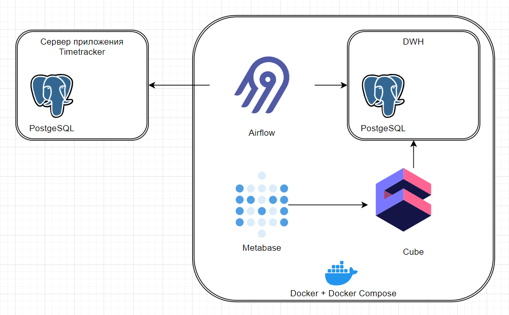
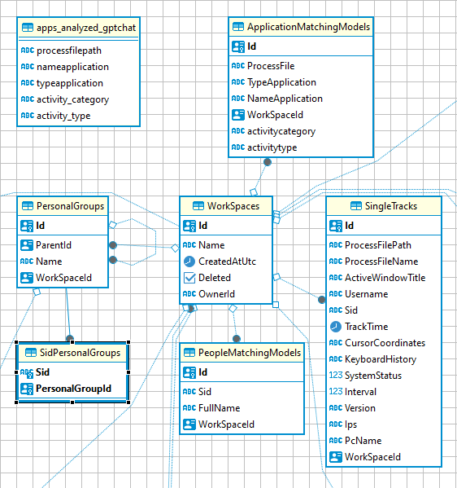
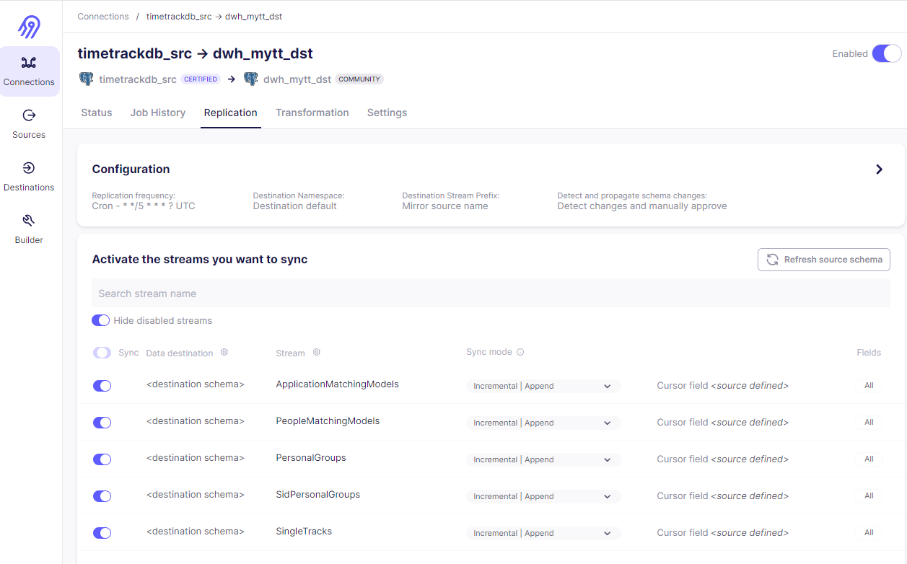
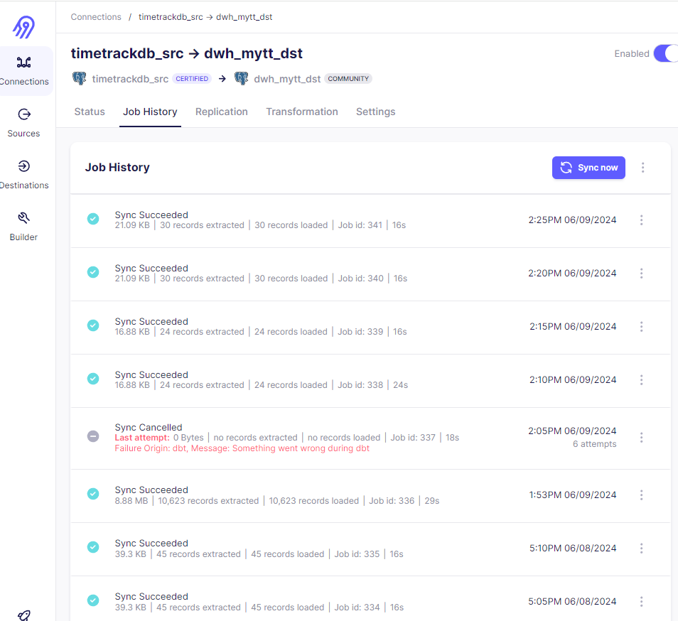
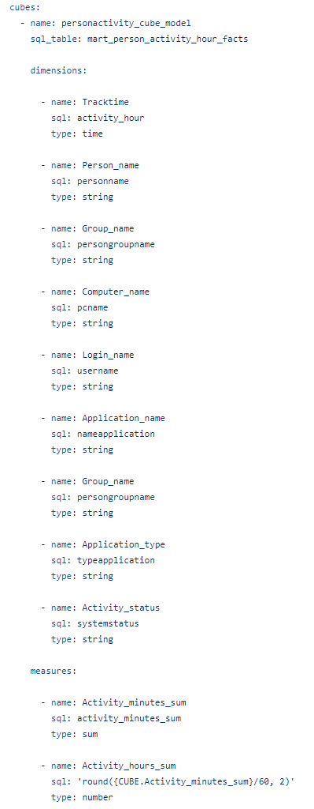
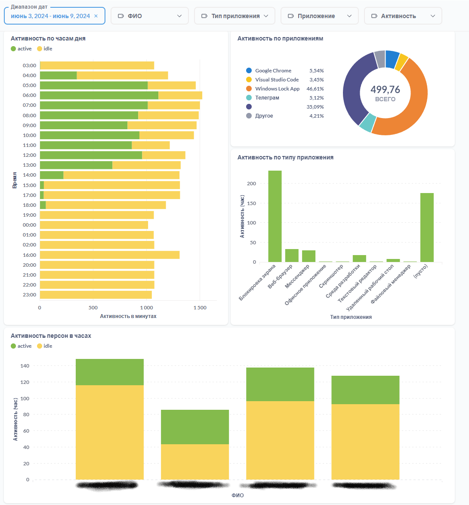

# My time tracker BI

Проект по ELT данных для анализа активностей пользователей на рабочем столе компьютера.

## Оглавление 

1. [Идея проекта](#идея-проекта)
1. [Описание архитектуры среды проекта](#описание-архитектуры-среды-проекта)
1. [Definition of Done](#definition-of-done)
1. [Установка окружения](#установка-окружения)
1. [Трасформация исходных данных](#трасформация-исходных-данных)
1. [Конфигурирование метрик Cube](#конфигурирование-метрик-cube)
1. [Визуализация на dashboard Metabase](#визуализация-на-dashboard-metabase)
1. [Выводы и вопросы](#выводы-и-вопросы)
1. [Дальнейшее развитие](#дальнейшее-развитие)

## Идея проекта

Создать визуализацию данных полученных с помощью приложения отслеживания активностей пользователй на комьютерах

## Описание архитектуры среды проекта
Составные части систменой архитектуры проекта:
- Airbyte - используется для загрузки данных из базы данных серверного приложения сборщика активностей в DWH.
- Postgres - как СУБД для DWH проекта и системной базы данных для Metabse
- Cube - для создания сементического слоя для аналитики ключевых метрик
- Metabase - для построения витрин bi
- Docker + Docker Compose - для создания среды работы решения с помощью развертывания контейнеров для работы вышеперечисленных систем.

## Definition of Done

✅ Развернута и произведена конфигурация среды обеспечения (Docker+Docker Compose, Airbyte, Postgres, Cube, Metabase)

✅ Создана база DWH в СУБД Postgres

✅ Настроена загрузки данны из источника в DWH

✅ Разработан dbt проект трансформации данных, в нем модели данных и их декларации

✅ Настроена и развернута модель метрик для Cube

✅ Настроена и развернута визуализация dashboard Metabase

## Установка окружения

### Установка Airbyte

Релизы https://github.com/airbytehq/airbyte/releases

Для данного решения была использована версия 0.50.37, так как последняя версия из-за неизвестной ошибки не смогла загрузить схему данных источника.

Установка в Docker Compose https://docs.airbyte.com/deploying-airbyte/docker-compose

### Установка других систем окружения

 Оставшиеся системы устанавливаются в Docker Compose и сконфигурированы в [Docker containers](./docker-compose.yml).

## Конфигурирвоание Airbyte pipeline для загрузки данных в DWH

Схема таблиц источника данных

Airbyte pipeline настройки
Загрука построена по incremental стратегии

Пример работы pipeline

## Трасформация исходных данных

### Staging слой

В данном слое создаются 2 модели
1) stg_singletracks_dedup - эта модель организована для решения проблемы дублирующихся записей, в которой происходит нахождение и удаление дублей в src таблицах перекаченных из источника в dwh.
Дополнительно реализована incremental стратегия обработки данных.
2) stg_applications_by_processfilepath - в данной модели происходит сопоставление названий приложений и типов приложений, используемых пользователями, по пути к файлу запущенных на компьютерах процессов.

### Intermediate

int_person_activities - модель  с материализацие view. В модели данные обогащаются связями для определения имен пользователей, названий приложений и их типов, групп пользователей

### Mart

mart_person_activity_hour_facts - расчитывается витрина данных с агрегацией времени активности по измерениями с гранулярностью - час.

## Конфигурирование метрик Cube

Модель описана [Cube model](./model/cubes/personactivity_cube_model.yml)

## Визуализация на dashboard Metabase

Для визауализации используется Metabase

## Выводы и вопросы

- Использование dbt позволяет системно подходить к решению ELT (декомпозиция на подсистемы, слои и модели данных, трансформация, ETL as code);
- Среда разработки dbt проектов не особо дружелюбная, тяжело производить refactoring, если необходимо переименование источников или полей модели данных и тд;
- Функция dbt_utils.deduplicate возможно сокращает написание кода, но работает медленнее, чем если использовать в коде функции партиционирования и нумерации строк по критериям для избавления от дублей. Работает медленее из-за того, что нужно сначала вызвать функцию и уже по resultset производить дополнительные манипуляции с данными, тогда как в "ручном управлении" это можно совместить в одном запросе;
- Airbyte в какой-то момент начал подкидывать дублирующиеся записи, пришлось дописывать трансформацию для исключения дублей в модели stg_singletracks_dedup;
- Airbyte можно добавить свою custom dbt transformation, необходимо разобраться, с первой попытки настроить не получилось. Может быть поддержка есть только в последней версии и только для dbt Cloud;
- Airbyte в последней версии не получилось настроить pipeline из-за ошибки при обследовании схемы данных источника в СУБД Postgre.

## Дальнейшее развитие

- Разработать сервис систематизации данных по действиям пользователей на основе неструктурированных данных
    а) для определения названия и типа приложения по пути к файлу процесса (поле processfilepath)
    б) для определения категории активности, типа активности и подтипа активности (по тексту поля activewindowtitle)
    г) для определения проекта, номера задачи из системы управления проектами  (поле activewindowtitle)

- С помощью данного проекта доработать полученние от сервиса информации и её загрузку в DWH в структурированном виде для дальнейшего обогащения данных для анализа и визуализации.

Разбор неструктурированных данных реализовать с помощью разбора через regexp выражения или сделать с помощью сервисов ИИ.

Пример разбора текста заголовка активного окна пользователя от ChatGPT
    
